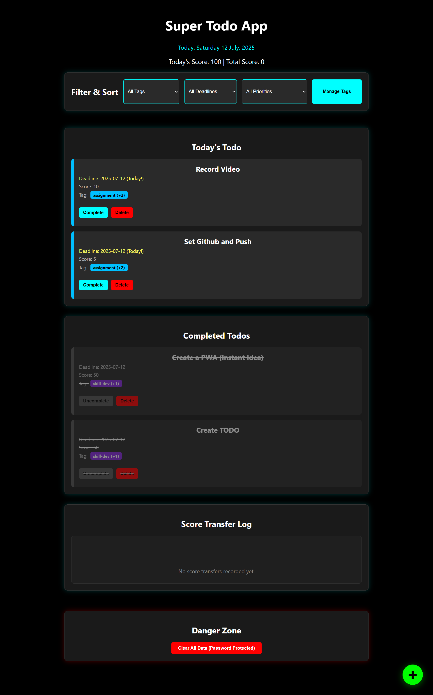

Absolutely! Here's a **beautifully formatted `README.md`** with badges, emojis, full Markdown styling, and example code blocks — perfect for your **"Super Todo"** PWA built with HTML, CSS, and JS.

---

```markdown
# 📝 Super Todo - PWA Task Manager

[](https://web.dev/progressive-web-apps/)
[]()
[]()
[]()
[](./LICENSE)

---

🎯 **Super Todo** is a minimal, responsive, and offline-first **Progressive Web App (PWA)** that lets you:

- ✅ Add, edit, and delete tasks
- 🏷️ Tag and filter todos
- 🎯 Earn productivity points by completing tasks
- 💾 Save data offline using `localStorage`
- 📱 Install to Home Screen like a native app!

---

## 🚀 Live Demo

> 🧪 Coming Soon! (Or host it with GitHub Pages / Netlify and drop your link here)

---

## 📸 Screenshots

| Desktop View                   | Mobile View                   |
| ------------------------------ | ----------------------------- |
|  |  |

---

## 🛠️ Tech Stack

| Tech             | Description                         |
| ---------------- | ----------------------------------- |
| `HTML5`          | Semantic markup                     |
| `CSS3`           | Layout & styling                    |
| `JavaScript`     | Core functionality                  |
| `localStorage`   | Persistent browser storage          |
| `Service Worker` | Offline capabilities                |
| `manifest.json`  | Web app manifest for installability |

---

## 📦 Project Structure
```

📁 super-todo/
│
├── index.html
├── style.css
├── script.js
├── manifest.json
├── sw\.js
└── icons/

````

---

## 🌐 How to Run Locally

```bash
git clone https://github.com/your-username/super-todo.git
cd super-todo
# Just open index.html in your browser!
````

---

## ⚙️ Enable PWA Support

1. Add a simple `manifest.json`:

```json
{
  "name": "Super Todo",
  "short_name": "Todo",
  "start_url": "./index.html",
  "display": "standalone",
  "background_color": "#ffffff",
  "theme_color": "#4CAF50",
  "icons": [
    {
      "src": "icons/icon-192.png",
      "sizes": "192x192",
      "type": "image/png"
    },
    {
      "src": "icons/icon-512.png",
      "sizes": "512x512",
      "type": "image/png"
    }
  ]
}
```

2. Register a `service worker` in `script.js`:

```js
if ("serviceWorker" in navigator) {
  window.addEventListener("load", () => {
    navigator.serviceWorker
      .register("./sw.js")
      .then((reg) => console.log("Service Worker Registered ✅", reg))
      .catch((err) => console.error("Service Worker Error ❌", err));
  });
}
```

3. Example `sw.js`:

```js
const CACHE_NAME = "super-todo-v1";
const urlsToCache = ["/", "/index.html", "/style.css", "/script.js"];

self.addEventListener("install", (event) => {
  event.waitUntil(
    caches.open(CACHE_NAME).then((cache) => cache.addAll(urlsToCache))
  );
});

self.addEventListener("fetch", (event) => {
  event.respondWith(
    caches
      .match(event.request)
      .then((response) => response || fetch(event.request))
  );
});
```

---

## 🧠 Features Explained

- 🗂 **Tag-Based Filtering**
  Group tasks with tags like `#work`, `#personal`, etc.

- 🏆 **Scoring System**
  Completing a task gives points! Reset and track progress over time.

- 💡 **localStorage**
  All your data is saved locally, no sign-up needed.

---

## 📥 Installation (PWA)

1. Open the app in Chrome or supported browsers.
2. Click **Install** or "Add to Home Screen" prompt.
3. Enjoy it like a native app 🎉

---

## 🤝 Contributing

Contributions, suggestions, and PRs are welcome!

1. Fork the repo
2. Create your feature branch (`git checkout -b feature/awesome-feature`)
3. Commit your changes
4. Push to the branch
5. Open a Pull Request

---

## 📜 License

This project is licensed under the **MIT License** – see the [LICENSE](./LICENSE) file for details.

---

## ❤️ Acknowledgements

- Built with pure HTML, CSS, and JavaScript!
- Inspired by [TodoMVC](https://todomvc.com/) and modern PWA principles.
- Icons from [Font Awesome](https://fontawesome.com/)

---

> ✨ Made with love and productivity ✨
> by [Your Name](https://github.com/your-username)

```

---

### ✅ Next Steps:
- Replace screenshot links with actual images.
- Replace `your-username` and live demo URLs.
- Add more badges (like GitHub stars, forks, etc. if hosted).
- Upload this as `README.md` in your root project folder.

Let me know if you'd like a minimal GitHub-ready version too.
```
